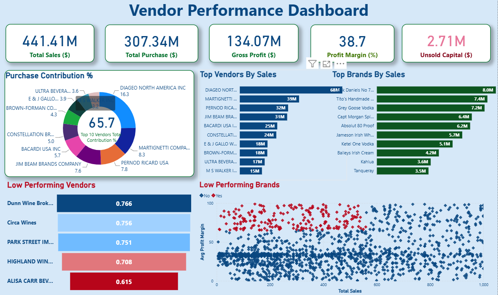

# 📊 Vendor Performance Analysis

## 📌 Project Overview

Vendor Performance Analysis is an end-to-end data analytics project that transforms raw purchasing and sales data into meaningful business insights.

The project demonstrates the complete analytics workflow—from data ingestion and database creation to SQL-based analysis, exploratory data analysis (EDA), KPI generation, and Power BI dashboard development.

This project helps organizations identify high-performing vendors, optimize procurement strategies, improve profitability, and reduce operational costs.

---

## ✨ Features

- ✅ Automated Data Ingestion
- ✅ SQLite Database Creation
- ✅ SQL-Based Data Analysis
- ✅ Data Cleaning & Transformation
- ✅ Exploratory Data Analysis (EDA)
- ✅ KPI Calculation
- ✅ Vendor Profitability Analysis
- ✅ Interactive Power BI Dashboard
- ✅ Business Report Generation

---

## 🛠️ Tech Stack

| Category | Technology |
|----------|------------|
| **Programming Language** | Python |
| **Database** | SQLite |
| **Libraries** | Pandas, SQLAlchemy, SQLite3, Logging |
| **Visualization** | Power BI |
| **Notebook** | Jupyter Notebook |

---

## 📂 Project Structure

```text
Vendor-Performance-Analysis/
│
├── data/
│   ├── begin_inventory.csv
│   ├── end_inventory.csv
│   ├── purchases.csv
│   ├── sales.csv
│   ├── purchase_prices.csv
│   └── vendor_invoice.csv
│
├── ingestion_db.py
├── get_vendor_summary.py
├── Vendor Performance Analysis.ipynb
├── Exploratory Data Analysis.ipynb
├── vendor_performance.pbix
├── Vendor Performance Report.pdf
├── README.md
└── .gitignore
```

---

## 🔄 Project Workflow

1. Load raw CSV files.
2. Store datasets in a SQLite database.
3. Merge purchase, sales, invoice, and pricing data using SQL queries.
4. Clean missing values and standardize the data.
5. Calculate business KPIs.
6. Generate the vendor summary.
7. Visualize insights using Power BI.

---

## 📊 Dashboard Preview

The Power BI dashboard provides insights into:

- 📈 Vendor-wise Sales & Profit
- 📦 Inventory Turnover
- 💰 Bulk Purchase Savings
- 📊 Performance Heatmaps

> **Screenshot**


---

## 📈 Key Performance Indicators (KPIs)

- 💰 Total Purchase Amount
- 📦 Purchase Quantity
- 🛒 Total Sales Revenue
- 📈 Gross Profit
- 💵 Profit Margin (%)
- 🚚 Freight Cost
- 📊 Sales vs Purchases
- 📦 Inventory Turnover
- ⭐ Top Vendors
- 📉 Low Performing Vendors

---
## ▶️ How to Run

### 1. Clone the Repository
git clone https://github.com/AnupeshPanigrahi/Vendor-performance-analysis.git
### 2. Navigate to the Project Folder
cd Vendor-performance-analysis
### 3. Install Dependencies
pip install pandas sqlalchemy
### 4. Load Data into SQLite
python ingestion_db.py
### 5. Generate Vendor Summary
python get_vendor_summary.py
### 6. Open the Dashboard
Open the following file using **Microsoft Power BI Desktop**:
vendor_performance.pbix

---
## 📊 Analytics Pipeline

CSV Files
    │
    ▼
Python ETL
    │
    ▼
SQLite Database
    │
    ▼
SQL Queries
    │
    ▼
Pandas Analysis
    │
    ▼
EDA Notebook
    │
    ▼
Power BI Dashboard

---
## 📷 Sample Output

✔ Database Created

✔ Data Loaded Successfully

✔ Vendor Summary Generated

✔ CSV Exported Successfully

✔ Dashboard Ready

---

## 🚀 Future Improvements

- Cloud Database Integration
- Streamlit Dashboard
- Machine Learning-based Vendor Prediction
- Automated ETL Pipeline
- Scheduled Report Generation
- Power BI Service Deployment
- REST API Integration
- Docker Containerization

---

## 💼 Skills Demonstrated

- Python Programming
- SQL
- SQLite
- Data Cleaning
- Exploratory Data Analysis (EDA)
- Business Intelligence
- Data Visualization
- ETL Pipeline Development
- KPI Design
- Power BI
- Problem Solving

---

## 🎯 Resume Impact

This project demonstrates practical experience in:

- End-to-End Data Analytics
- Business Intelligence Reporting
- Database Management
- SQL Query Optimization
- Python Automation
- Data Visualization
- Business KPI Development

---

## 👨‍💻 Author

**Anupesh Panigrahi**

🎓 B.Tech (Computer Science & Engineering)

📊 Aspiring Data Analyst | Business Intelligence | Python | SQL | Power BI

- 🔗 GitHub: https://github.com/AnupeshPanigrahi
- 🔗 LinkedIn: https://linkedin.com/in/anupeshpanigrahi

---
<div align="center">

### ⭐ If you found this project useful, please consider giving it a Star!

**Happy Learning! 🚀**

</div>
